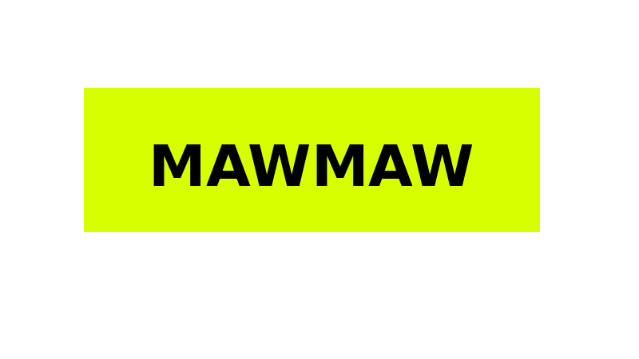

<div align="center">



**A high-performance telemetry and event processing engine.**

</div>

---    


**MAWMAW** is a high-performance, plugin-driven event processing engine written in modern C++.

It ingests events from arbitrary sources, processes them through configurable pipelines, and publishes the results to arbitrary destinations—all without modifying or recompiling the core engine.

Designed for applications where low latency, extensibility, and runtime configurability matter, MAWMAW can power telemetry systems, industrial automation, financial data pipelines, monitoring infrastructure, and other real-time event-driven applications.

**Core principles**

* Runtime-loadable plugins
* Configurable processing pipelines
* Native C++ performance
* Hot-reloadable components
* Source and destination agnostic
* Minimal core, application-specific logic lives in plugins


---    

## Guides

plugin guide: [plugin_guide.md](https://github.com/kyuQee/mawmaw/blob/master/ingestor/plugin_guide.md)
config guide: [config_guide.md](https://github.com/kyuQee/mawmaw/blob/master/config/config_guide.md)
docs: [docs.md](https://github.com/kyuQee/mawmaw/blob/master/docs/docs.md)

---    


## Cloning
```bash
git clone --recurse-submodules https://github.com/kyuQee/mawmaw.git
```

---
## Dependencies

MAWMAW requires:

- C++20 compiler (GCC or Clang)
- CMake (3.22+)
- Ninja
- LLVM + LLD
- Python 3
- Python development headers (`Python.h`)

> **Note:** Installing Python alone is **not sufficient**. The Python development headers is required because MAWMAW links against the Python C API.

---

## Ubuntu / Debian

```bash
sudo apt update

sudo apt install -y \
    build-essential \
    clang \
    lld \
    llvm \
    cmake \
    ninja-build \
    python3 \
    python3-dev \
    libasan8 \
    libubsan1
```

---

## Rocky Linux / RHEL / AlmaLinux / CentOS Stream

```bash
sudo dnf install -y \
    gcc \
    gcc-c++ \
    clang \
    llvm \
    lld \
    cmake \
    ninja-build \
    python3 \
    python3-devel \
    libasan \
    libubsan
```

---

## Fedora

```bash
sudo dnf install -y \
    gcc \
    gcc-c++ \
    clang \
    llvm \
    lld \
    cmake \
    ninja-build \
    python3 \
    python3-devel \
    libasan \
    libubsan
```

---

## Arch Linux

```bash
sudo pacman -Syu --needed \
    gcc \
    clang \
    llvm \
    lld \
    cmake \
    ninja \
    python
```

(Python development headers are included with the `python` package.)

---

## openSUSE

```bash
sudo zypper install \
    gcc \
    gcc-c++ \
    clang \
    llvm \
    lld \
    cmake \
    ninja \
    python3 \
    python3-devel
```

(Sanitizer runtimes come with GCC.)

---

## Alpine Linux

```bash
sudo apk add \
    build-base \
    clang \
    llvm \
    lld \
    cmake \
    ninja \
    python3 \
    python3-dev
```

---

## macOS (Homebrew)

```bash
brew install \
    llvm \
    cmake \
    ninja \
    gcc \
    python
```

(Homebrew's Python includes the development headers.)

---


## Windows

dont use

or wsl2 (not preferred)

---    


## Known Issues

* Python is linked at **compile time**, so user must build it on their system. (FIXED, Under Testing)
* Memory Leaks from Python interpreter on shutdown.
* Limited Endpoints (https, csv, influxDB, Prometheus, etc TO BE ADDED)
